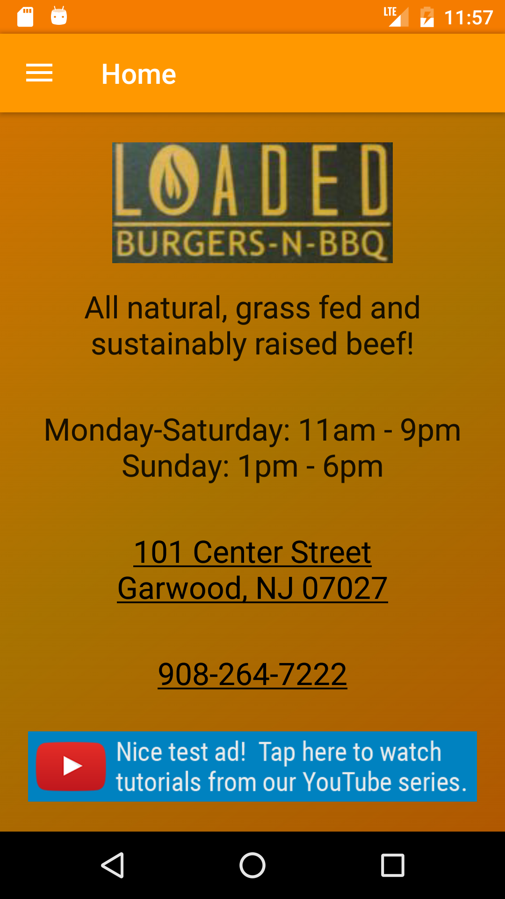
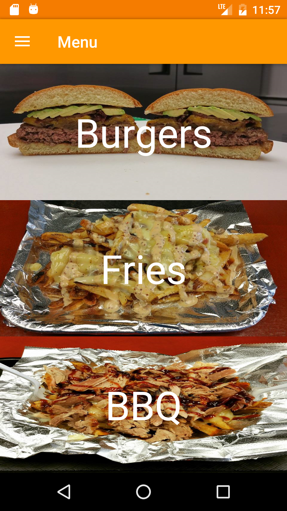
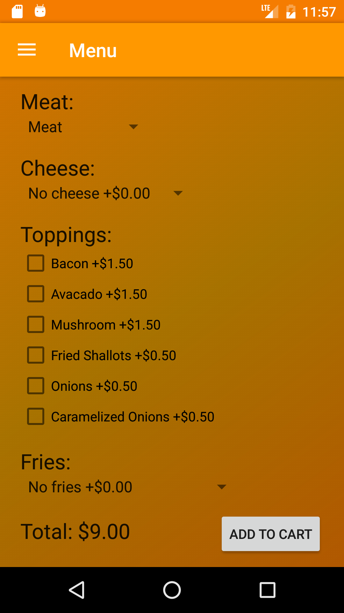
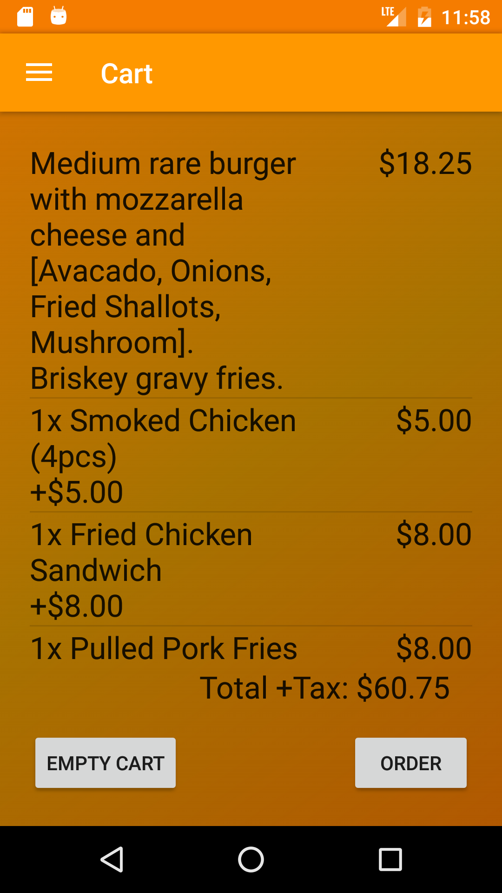

# Udacity-Capstone-Project

##Loaded

###Overview:

Loaded is an app created for <a href = "http://loadednj.com/">Loaded Burgers-N-BBQ</a>. The app gives basic information on the restaurant and allows you to order from them while calculating your total.  This app makes use of Firebase's database, admob, and analytics in addition to meeting <a href = "https://review.udacity.com/#!/rubrics/65/view"> Udacity's requirements</a> for their Capstone Project submission.

###Libraries used:
- <a href = "https://firebase.google.com/">Firebase</a>
- <a href = "https://github.com/square/picasso">Picasso</a>

###ToDo:
In order to make it a full functional app, once this app passes Udacity's review, I intend to add real payment function through the use of <a href = "https://github.com/venmo/app-switch-android">Venmo</a>.  Additionally, I will work with the owners of Loaded to improve upon the UI depending on their wants.

###Screenshots:
 
 
 
 
